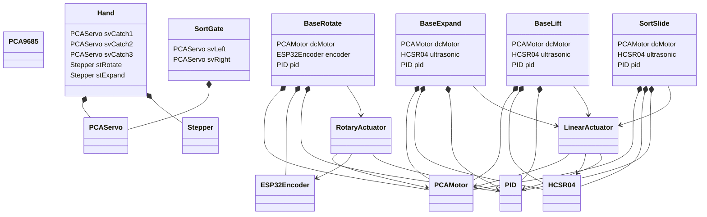

# T.O.G.O. remake
自己満リファクタリング by Tomoooji

---

```
TOGO_remake/
├─ include/                        # ヘッダーファイルフォルダ
│  ├─ Components.h
│  ├─ GainConfig.h
│  ├─ PinConfig.h
│  └─ README
├─ lib/                             # ライブラリフォルダ(ほぼ自作)
│  ├─ Ultils/                       # 汎用関数ライブラリ
│  │  └─ UtilFunctions.h
│  ├─ ESP32Stepper/                 # ESP32用ステッピングモータ制御ライブラリ
│  │  ├─ ESP32Stepper.cpp
│  │  └─ ESP32Stepper.h
│  ├─ PCA9685/                      # PCA9685用I2C制御ライブラリ(秋月電子製)
│  │  ├─ examples/
│  │  │  └─ PCA9685_Sample/
│  │  │     └─ PCA9685_Sample.ino
│  │  ├─ PCA9685.cpp
│  │  ├─ PCA9685.h
│  │  └─ readme.txt
│  ├─ PCAMotor/                     # PCA9685用モータ制御ライブラリ
│  │  ├─ PCAMotor.cpp
│  │  └─ PCAMotor.h
│  ├─ PCAServo/                     # PCA9685用サーボモータ制御ライブラリ
│  │  ├─ PCAServo.cpp
│  │  └─ PCAServo.h
│  ├─ UltraSonic_AsyncTask/         # 超音波センサ用ライブラリ
│  │  ├─ UltraSonic.cpp
│  │  └─ UltraSonic.h
│  ├─ UltraSonic_ISRState/          # 超音波センサ用ライブラリ(ボツ)
│  │  ├─ UltraSonic.cpp
│  │  └─ UltraSonic.h
│  ├─ PID/                          # PID制御用ライブラリ
│  │  ├─ PID.cpp
│  │  └─ PID.h
│  ├─ LinearActuator/               # 直動機構(DCモーター+超音波センサ)用ライブラリ
│  │  ├─ LinearActuator.cpp
│  │  └─ LinearActuator.h
│  ├─ RotaryActuator/               # 回転機構(DCモーター+エンコーダ)用ライブラリ
│  │  ├─ RotaryActuator.cpp
│  │  └─ RotaryActuator.h
│  └─ README
├─ src/                             # メインのコードフォルダ(動作確認用含む)
│  ├─ check_linear_actuator.cpp
│  ├─ check_rotary_actuator.cpp
│  ├─ check_ultrasonic.cpp
│  └─ main.cpp
├─ test/                            # 使ってない(そもそもテストなんて文化しらない)
│  └─ README
├─ platformio.ini
└─ README.md
```

# クラス図
